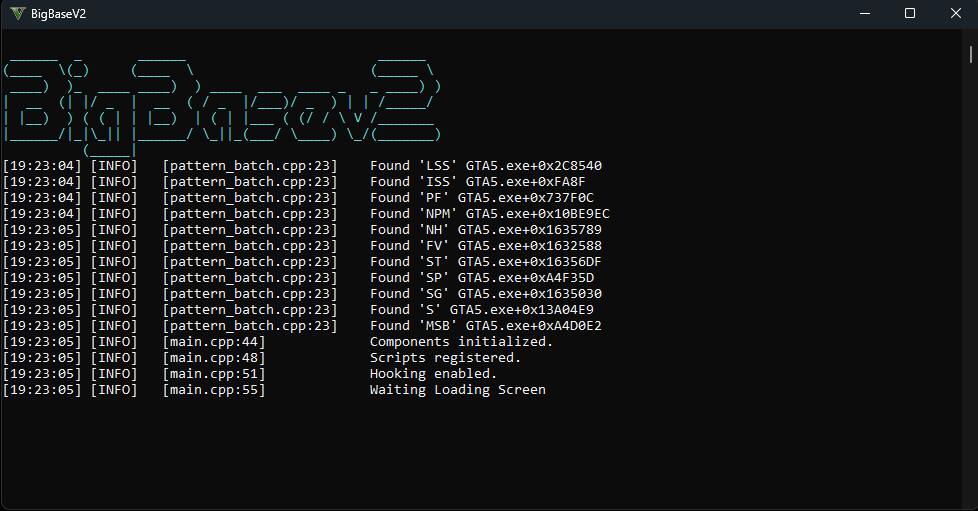
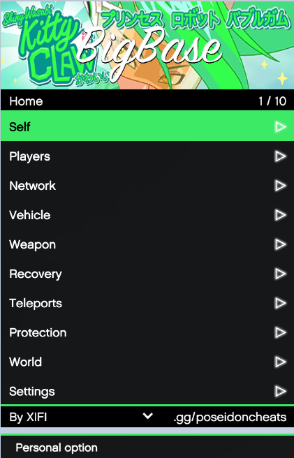
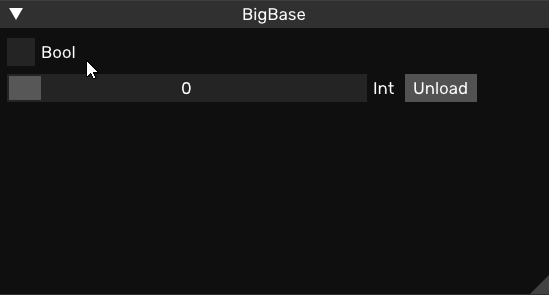

# BigBase-V1-V2
BigBase V2 but V1 list and click ui

# Element

- Fiber Pool
- Script Manager
- Native UI
- List & Click
- Smooth Scroll
- Hooking Deotur, VMT
- Script
- Logger
- ImGui–based user interface
- Unloading at runtime
- Access to YSC script globals
- scrProgram–based native hook

# Update

- Updated Native
- Updated Crossmap
- Updated Pattern
- Updated Hooks

# Important
Build in release

# Credit
- Updated And Created By XIFI
- Pockaking Original Repository -> [Repository](https://github.com/Pocakking/BigBaseV2)

# Screen Shot

